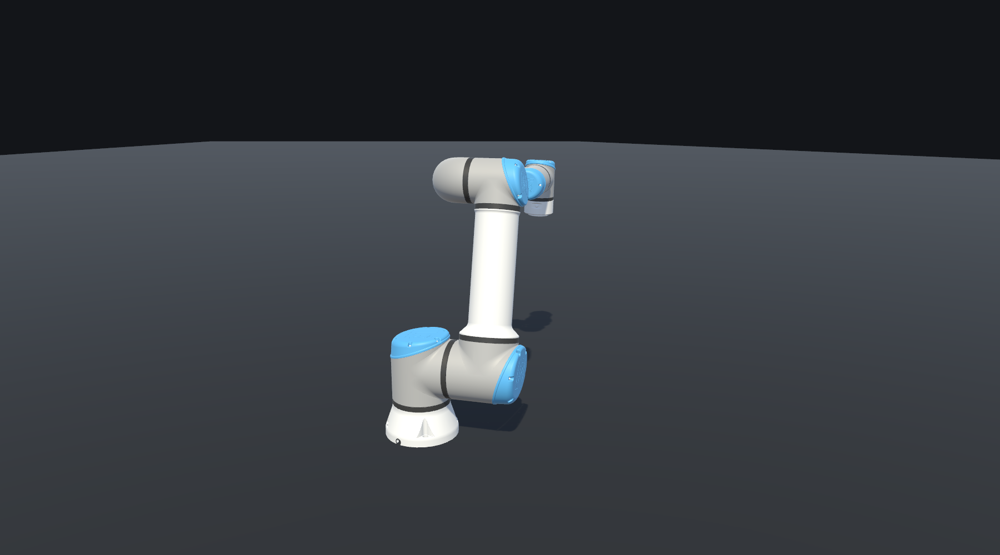
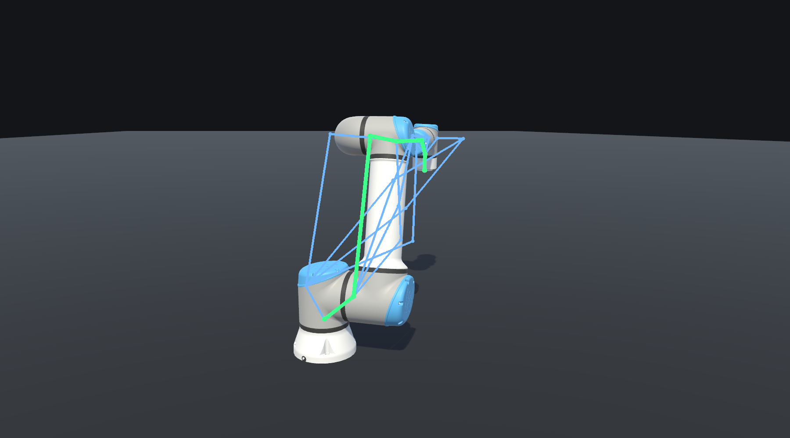
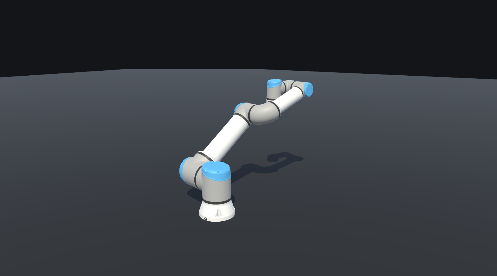

# Inverse Kinematics for the UR16e in Unity

Analytic (closed-form) inverse kinematics for the Universal Robots UR16e, following the
standard UR solution (Hawkins 2013, *Analytic Inverse Kinematics for the Universal Robots
UR-5/UR-10 Arms*). Move the IK target and the arm follows it, choosing among the up-to-8
joint configurations that reach the same flange pose.

## Usage

**In the editor** — open `Assets/Scenes/main.unity` and drag the **IK- MOVE THIS GAMEOBJECT**
transform. The arm re-solves as you move it, in edit mode as well as in play mode.

The inspector on `UR_16e` lists the eight analytic branches with their joint angles, marks
the ones that are unreachable for the current target, and lets you apply any valid branch
with one click. Set **Selection Mode** to `ClosestToCurrent` to always follow the branch
nearest to the current joints, which avoids configuration jumps as the target moves.

**In play mode** — the `IKTargetController` on the Main Camera adds runtime control:

| Input | Action |
| --- | --- |
| Drag the handle | move the target in the camera plane |
| Scroll | push the target towards or away from the camera |
| `Q` / `E`, `Z` / `C` | yaw / pitch the flange |
| `1`–`8`, `PageUp` / `PageDown` | pick a solution branch |
| `Space` | toggle manual vs closest-to-current selection |
| `O` | demo orbit — the target sweeps the workspace on its own |
| `R` / `H` | reset the target / hide the legend |

## The eight solutions

A 6-axis UR arm reaches almost every pose in eight distinct ways: shoulder left or right,
wrist flipped or not, elbow up or down. Green is the applied configuration, blue are the
other valid candidates for the same target.

Switching branch keeps the flange exactly where it is and changes only how the arm gets there:

## Code

| File | Role |
| --- | --- |
| `Assets/Scripts/URKinematics.cs` | the solver: forward kinematics, the 8-branch closed-form inverse, wrist-singularity handling, per-branch reachability, closest-solution selection. Plain C#, double precision, no `UnityEngine` dependency, so it can be unit-tested outside the editor. |
| `Assets/Scripts/IK_toolkit.cs` | `[ExecuteAlways]` component that converts the Unity left-handed target pose into the robot's DH base frame, runs the solver only when the target actually moves, and applies the chosen branch to the rig. Also draws the scene gizmos. |
| `Assets/Scripts/IKTargetController.cs` | runtime mouse and keyboard control of the IK target. |
| `Assets/Scripts/Editor/IK_toolkitEditor.cs` | the solution table in the inspector. |
| `Assets/Scripts/Editor/ScreenshotCapture.cs` | renders the images above headlessly (`-executeMethod ScreenshotCapture.CaptureAll`). |

The DH parameters are the official Universal Robots values for the UR16e
(`d1 = 0.1807`, `a2 = -0.4784`, `a3 = -0.36`, `d4 = 0.17415`, `d5 = 0.11985`, `d6 = 0.11655`,
`alpha = {90, 0, 0, 90, -90, 0}` degrees). Another arm in the series differs only in those
six numbers.

## Accuracy

The solver is validated by a forward → inverse → forward round trip over thousands of random
reachable poses:

- every returned branch reproduces the target pose to within about `5e-14` m;
- the joint vector used to generate the pose always reappears among the branches;
- targets outside the workspace are reported as unreachable per branch rather than returning
  wrong angles;
- at the wrist singularity (`theta5 = 0`, which includes the UR home pose) joint 6 is pinned
  to the caller's current angle instead of being left to numerical noise.

## Citation

Damien Mazeas. mazeasdamien/Inverse-Kinematics-Universal-Robot-Unity. Zenodo.
https://zenodo.org/records/21796674

That record is version 2, archived from the `v2.0.0` release. To cite every version at once
rather than this one, use the concept DOI `10.5281/zenodo.15265717`, which always resolves to
the most recent.
